# Data Model

The single source of truth is [`backend/prisma/schema.prisma`](../backend/prisma/schema.prisma);
this page explains it (SCRUM-49). PostgreSQL on Supabase, accessed only by the
backend through Prisma. Every table has a UUID primary key and `created_at`, and
Row Level Security enabled with no policies (Supabase's REST API is closed).

## Phase 1 (built)

```mermaid
erDiagram
    users ||--o| user_profiles : "has"
    users ||--o{ refresh_tokens : "signs in with"
    users ||--o{ ai_conversations : "chats"
    users ||--o{ assessments : "takes"
    users ||--o{ user_task_submissions : "submits"
    users ||--o{ ai_usage : "is metered by"
    users ||--o{ notifications : "receives"
    skills ||--o{ assessments : "is checked by"
    skills ||--o{ learning_resources : "is taught by"
    skills ||--o{ practical_tasks : "is practised by"
    assessments ||--o| assessment_results : "scores"
    assessments ||--o{ ai_conversations : "may log"
    practical_tasks ||--o{ user_task_submissions : "receives"

    users {
        uuid id PK
        string email UK "normalised"
        string password_hash "null for Google-only"
        string google_id UK
        enum role "STUDENT MENTOR ADMIN"
        bool is_active
        bool is_deleted
    }
    user_profiles {
        uuid user_id FK,UK
        jsonb profile_data "everything onboarding collects"
        timestamptz onboarding_completed_at
    }
    refresh_tokens {
        uuid user_id FK
        string token_hash UK
        timestamptz expires_at
        timestamptz revoked_at
    }
    email_otps {
        string email
        string otp_hash
        enum purpose "SIGNUP PASSWORD_RESET LOGIN"
        int attempts "max 3"
        bool is_used
    }
    skills {
        string slug UK
        enum category "TECHNICAL APTITUDE SOFT"
        int mastery_threshold "default 40"
        bool is_active
        bool is_deleted
    }
    assessments {
        uuid user_id FK
        uuid skill_id FK
        enum status "IN_PROGRESS COMPLETED ABANDONED"
        jsonb questions "pool + answers; answer_index never leaves the server"
    }
    assessment_results {
        uuid assessment_id FK,UK
        float score
        float max_score
        int threshold "copied from the skill when scored"
        enum mastery_status "MASTERED NEEDS_REVISION"
    }
    ai_conversations {
        uuid user_id FK
        enum agent_type "ONBOARDING ASSESSMENT DASHBOARD"
        jsonb messages
    }
    learning_resources {
        uuid skill_id FK
        enum type "REFERENCE EXAMPLE LECTURE PRACTICE"
        string url "or content, never both"
        text content
        bool is_deleted
    }
    practical_tasks {
        uuid skill_id FK
        enum difficulty
        jsonb evaluation_criteria "the rubric"
        bool is_deleted
    }
    user_task_submissions {
        uuid user_id FK
        uuid task_id FK
        text submission_content
        float score "percent, computed by the server"
        bool passed
        jsonb ai_feedback
    }
    ai_usage {
        uuid user_id FK
        string feature
        int input_tokens
        int output_tokens
        bool success
    }
    notifications {
        uuid user_id FK
        string type
        string href
        timestamptz read_at
    }
```

`email_otps` stands alone: codes are keyed by email because they're issued
before an account exists.

## Key decisions

- **Identity vs profile.** `users` holds identity and auth only. Everything the AI
  onboarding learns lives in `user_profiles.profile_data` (JSONB), so a new
  onboarding question never needs a migration.
- **Skills are shared.** The same `skills` rows drive skill checks, learning
  resources and practical tasks today, and will tag Phase 2 question-bank
  questions — no second taxonomy.
- **History is never rewritten.** A retake is a new `assessments` row (progress
  over time comes for free). `assessment_results.threshold` is copied from the
  skill at scoring time, so changing a pass mark only affects new checks.
- **Soft delete for admin content.** Skills, resources and tasks are never hard
  deleted (`is_deleted`), and skills/tasks are `ON DELETE RESTRICT` from student
  rows, so a student's history can't silently break.
- **Scores are computed, not generated.** The AI writes questions and marks
  rubric criteria; percentages, mastery and pass/fail are computed by the server
  (`assessment.logic.ts`, `tasks.logic.ts`, `dashboard.logic.ts`).
- **Everything AI is metered.** One `ai_usage` row per provider call, from day
  one, so the free trial and any later paid tier need no rebuild.
- **Notifications are generic.** `type` is a string and the payload is JSON, so
  Phase 2/3 events (session booked, mentor note added) need no migration.

## Planned (not built yet)

| Phase | Tables | Notes |
|---|---|---|
| 2 — Interview prep | `question_bank`, `user_question_progress` | Questions tagged by `skills.id`; bookmark/solved per user. |
| 3 — Mentorship | `mentor_profiles`, `mentor_availability`, `sessions`, `chat_messages` | Reuse `users` (role `MENTOR`); session notes feed the dashboard's next steps. |
| 4 — Advanced AI | `resumes` (or columns on profile) | Resume feedback; readiness PDF is generated, not stored. |
